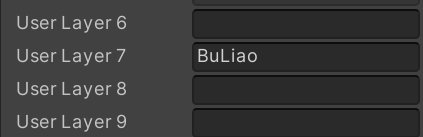

# A-Simple-Embroidery-system

## 简介:

【效果图……】

是一款基于Unity引擎与ObiRope插件实现的刺绣游戏

此项目尚未完成。

**当前进度：**

- 完成了**绳子的控制**与**针头吸附**的功能。 ——————2025/2/17前
- 完成了**撤销**针线与**回忆**操作的功能。              ———————2024/2/17日

且项目框架也是一团糟，待作者对框架领悟更多之后一定在README中添加框架与类的相关介绍。

***望各位海涵！***

**备注:** 这个系统现在里面存在许多意义不明的类与资源

比如:TODO.cs 、TestCode文件夹中的代码(实际上是为了测试一些写法的正确性)

还有一些莫名奇妙的shader(也是学习用),忽略即可。

真正核心为***EmbroideryFramework***目录下的代码。

## 下载须知：
1. 由于本仓库中只有Asset的内容。由此你需要先创建一个Unity URP项目。
2. 插件需求：
   1. new Input system
3. layer设置
   1. 由于本项目使用了物理检测，并设置了layer
   2. 如果出现不能正常使用的情况。请添加以下layer(后续如果有其他layer的设置我会实时更新)

## 功能简介：
一.**撤销与回忆**功能:

## 项目目标：

- [x] 实现刺绣撤销操作
- [ ] 实现保存系统
- [ ] 自己Rope的模拟系统(有时间再说)
- [ ] 实现刺绣数据的持久化
- [ ] 实现刺绣模型实时导出(有时间再说)

## 待解决问题：
- [ ] 每个针脚都不是严格意义上的链接在一起，需要在针脚改变mesh或者添加仿真模型来完成。

## 待修BUG：
- [ ] 修改针头触发不灵敏,容易针头穿过之后任然没有触发判定
- [x] 修改撤销操作之后，针不改变上下位置的BUG（其实不是BUG，是设计上的问题）
    - 解决方式：将撤销设置成连续撤销两次来规避这个问题。（无论是键鼠操作还是VR操作都需要规避这个问题）

